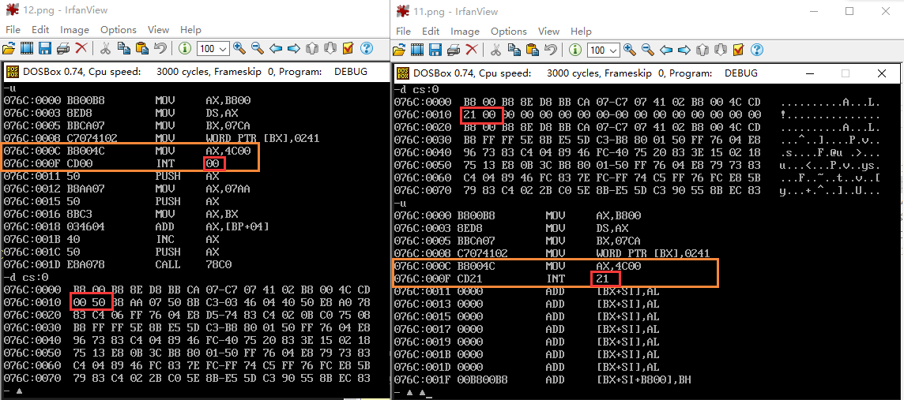

# 项目1 2017.01.16
第一天，开始的时候忘记计算一个段的大小，导致蒙蔽的开始用dup填充数据，妄想填充到0b800h哪里，显然无能为力。
之后，想到其实cs自动定位到第一个段，数据 即 程序，程序也可为数据，便想到，先写正常程序，编译后将数据填充到数据段中，完成程序后删除code段。
然后，填充的时候，填充数据填充少了一位，(相当于推出代码int 0)，导致出现其他字符。
解决如上问题，终于完成。
再次验证，设计论证的重要性！效率在哪里！！！
代码如下:
```asm
data segment
	dw 00b8h,8eb8h,0bbd8h,07cah,07c7h,0241h,00b8h, 0cd4ch, 0021h
data ends
```
等价于
```asm
assume cs:code
code segment
	mov ax,0b800h
	mov ds,ax
	mov bx,0a0h*12+25h*2
	mov word ptr ds:[bx],0241h
	
	mov ax,4c00h
	int 21h
code ends
```
