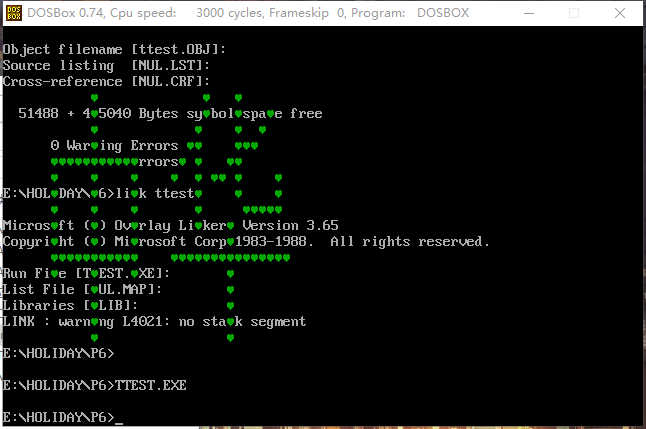

# [项目1](https://github.com/ExFly/CsLearning/blob/master/Language/ASM/holiday/p1/p1.asm) 2017.01.16

第一天，开始的时候忘记计算一个段的大小，导致蒙蔽的开始用dup填充数据，妄想填充到0b800h哪里，显然无能为力。
之后，想到其实cs自动定位到第一个段，数据 即 程序，程序也可为数据，便想到，先写正常程序，编译后将数据填充到数据段中，完成程序后删除code段。
然后，填充的时候，填充数据填充少了一位，(相当于推出代码int 0)，导致出现其他字符。
解决如上问题，终于完成。
再次验证，设计论证的重要性！效率在哪里！！！
代码如下:
```asm
data segment
	dw 00b8h,8eb8h,0bbd8h,07cah,07c7h,0241h,00b8h, 0cd4ch, 0021h
data ends
```
等价于
```asm
assume cs:code
code segment
	mov ax,0b800h
	mov ds,ax
	mov bx,0a0h*12+25h*2
	mov word ptr ds:[bx],0241h
	
	mov ax,4c00h
	int 21h
code ends
```

# [项目2](https://github.com/ExFly/CsLearning/blob/master/Language/ASM/holiday/p2/p2.asm) 2017.01.17
* 没有挑战性

 

# [项目3](https://github.com/ExFly/CsLearning/blob/master/Language/ASM/holiday/p3/p3.asm) 2017.01.18
* 学了一个指令 jcxz (cx)==0时跳转，再也不用loop做跳转了
* 没挑战性


# [项目4](https://github.com/ExFly/CsLearning/blob/master/Language/ASM/holiday/p4/p41.asm) 2017.01.19
* 算数得到结果比较简单，但是64的输出有点难度。解决办法是通过除10取余数，并push余数，当商为0时，可以确认已经将所有位处理过，将结果出栈，放到显存相应位置就好了，
* jcxz配合jmp超好用。


# [项目5](https://github.com/ExFly/CsLearning/blob/master/Language/ASM/holiday/p5/p51.asm)
* 系统的学了下call和ret，c的函数调用，完成了一些[常用方法的实现](https://github.com/ExFly/CsLearning/blob/master/Language/ASM/subprocess)与测试用例
* 这个项目难点是各种跳转逻辑的实现，逻辑有些复杂，使用cmp jne je 等之类的指令，可以很好的完成项目
* 实现了 循环(while do...while) and 选择(if)


------

# [项目6](https://github.com/ExFly/CsLearning/blob/master/Language/ASM/holiday/p6/p6.asm)
* 开始先找了一个字模提取工具，字模的原理是16*16字模，每8bit表示 8格，刚好一字节一个格。知道原理后只需要将每位数据调整后，提取出每一位即可。提取原理即可由除以2取余数，一个一个的取得。取得后，既可以通过判断每一位是否为零，在相应的位输出相应的数据。这里，想到的处理数据的方式有的两种：
	1. 通过分两个处理过程，一个过程先处理高8位，后处理低8位，16bit分别入栈，通过pop，输出数据，判断其值大小，并输出结果 
	2. 将数据两个字节交换位置 即ah,al = al,ah，后直接取余入栈，后出栈判断输出，既可以得到结果
* 程序的逻辑比之前复杂，通过将屏幕打印封装成函数，将其他的一些过程封装，利用子程序，降低程序的复杂度
* 开始犯的错误是，想自己创建两个栈，一个栈用来处理函数的调用，另一个栈存储div后得到的余数。思路是合理，但是由于一些逻辑错误中途放弃了。错误的原因可能是：
	1. 程序设置了两个栈，而且栈出栈和入栈操作分布在两个函数里，在对栈的切换有问题；
	2. pop的数量和push数量不同，导致函数处理栈别破坏，ret时无法返回到调用位置。
* 过度设计的错，导致重新设计，设计需要适可而止。
* 下了一个文档，不知道有没有用，[计算机硬件技术实验指导书](p6/计算机硬件技术实验指导书.doc)
* 截图即可看出处理的思路




# [项目7](https://github.com/ExFly/CsLearning/blob/master/Language/ASM/holiday/p7/p7.asm)
* 实现的思路和p6基本一样，由于没有考虑屏幕的大小，设计的时候图案填充满16*16，但是显示的时候扁了，以后注意下
* 程序没有花多长时间，但是处理图案得到位图的时间有点长。
* 程序与原图案有区别，区别在于原图案中有'.'，其实只是加了一次点的绘制，只是重复劳动，没有新的收获，就先不搞了，以后有时间不全。
* 如下效果图


# [项目8](https://github.com/ExFly/CsLearning/blob/master/Language/ASM/holiday/p8/p8.asm)
* 通过之前实现的输出子程序，可以很简单的实现
* 移动效果可以通过清楚前一位置图案，后输出当前位置图案，如此循环实现。
* 效果如下:


# [项目9](https://github.com/ExFly/CsLearning/blob/master/Language/ASM/holiday/p9/p9.asm)
* 估计这是前9个项目用时间最少的一次了。
* mainloop处理所有128字符，其中用div 8余数判断是否换行，改变行号和列号


# [项目10](https://github.com/ExFly/CsLearning/blob/master/Language/ASM/holiday/p10/p10.asm)
* 和项目9差不多，没有太大的难度


# [项目11](https://github.com/ExFly/CsLearning/blob/master/Language/ASM/holiday/p11/p11.asm)
* 没难度
* 效果如下


* 最终效果


# 计划
。。。
