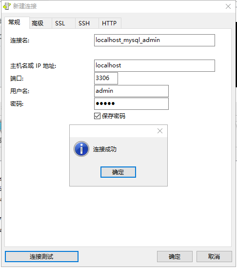
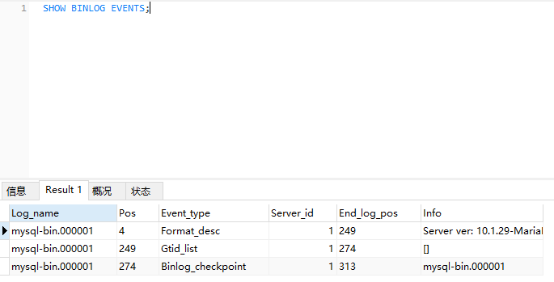

# MySql数据库安装、设计、维护、迁移、优化
## MySQL数据库安装
因为数据库比较影响电脑性能。而且只是为了测试数据库，所以这里先安装xampp-portable-win32-7.2.0
[xampp](1xampp_contral_panel.png)
* PHP to 7.2.0
* Apache to 2.4.29
* MariaDB to 10.1.29
* OpenSSL to 1.0.2n (Unix)/ 1.1.0g (Windows)
* phpMyAdmin 4.7.6

## 安装后流程
### [创建用户和授权](https://www.jianshu.com/p/d7b9c468f20d)

* 创建用户 test （从任意远程主机登陆，可以使用通配符%） CREATE USER 'username'@'host' IDENTIFIED BY 'password'; CREATE USER 'admin'@'%' IDENTIFIED BY 'admin';
* 授权 GRANT privileges ON databasename.tablename TO 'username'@'host'
GRANT ALL ON *.* TO 'test'@'%';

* 创建了一个账号 admin admin
* 一个用户只能被赋予一个ROLE，最后一次授予生效

### 新创建用户后无法登陆
MySQL中默认存在一个用户名为空的账户，只要在本地，可以不用输入账号密码即可登录到MySQL中。而因为这个账户的存在，导致了使用密码登录无法正确登录。

```
mysql -u root   # 以root账户登录MySQL

use mysql   #选择mysql库

delete from user where User='';  #删除账号为空的行
flush privileges;  #刷新权限
exit  #退出mysql
```

[解决办法](https://www.jianshu.com/p/834b0a47fc08)

## 开始使用
基本sql命令的使用
创建数据库 utf8mb4,utf8mb4_unicode_ci

### 经常使用的命令
```sql
SHOW DATABASES;
USE Dbname;
CREATE DATABASE firstdb DEFAULT CHARACTER SET utf8mb4;
DROP DATABASE firstdb;
CREATE USER 'username'@'host' IDENTIFIED BY 'password';
GRANT privileges ON databasename.tablename TO 'username'@'host'
FLUSH PRIVILEGES;
CREATE TABLE IF NOT EXISTS tab_name ( id CHAR ( 32 ) NOT NULL );
DROP TABLE IF EXISTS tab_name;

CREATE TABLE IF NOT EXISTS tab_test ( fd1 INT NOT NULL, fd2 VARCHAR ( 50 ), PRIMARY KEY ( fd1 ) );
INSERT INTO tab_test ( fd1, fd2 ) VALUES( 1, 'Matt' );
SELECT * FROM tab_test;
UPDATE tab_test SET fd1=2 WHERE fd1=1;
DELETE FROM tab_test WHERE fd1 = 2;
```

### 首先创建一个测试用的表，导入数据
用python脚本进行自动生成数据，从上午10点总有到16.30，生成了226176条记录

### 执行普通命令
```sql
CREATE TABLE IF NOT EXISTS tab_test ( fd1 INT NOT NULL, fd2 VARCHAR ( 50 ), PRIMARY KEY ( fd1 ) );
INSERT INTO tab_test ( fd1, fd2 ) VALUES( 1, 'Matt' );
SELECT * FROM tab_test;
UPDATE tab_test SET fd1=2 WHERE fd1=1;
DELETE FROM tab_test WHERE fd1 = 2;
```
## 执行计划分析
优化器 基于代价 基于规则
```sql
SHOW TABLES LIKE '%_stats';
EXPLAIN SELECT * FROM text;

```
EXPLAIN

### 管理与诊断
* SHOW PROCESSLIST; 
* SHOW STATUS;
* SHOW GLOBAL STATUS;
* SELECT SUM( MEMORY_USED ) FROM information_schema.`PROCESSLIST`;

## 备份恢复
使用 二进制日志远程备份 和 XtraBackup进行备份

* 完全备份 每周
* 事务日志备份 <1h
* 差异备份 增量备份 每天
* 文件备份 （不常用）


* 冷备份
* 热备份
* 逻辑备份

### mysqlbinlog
#### 完全备份
mysqldump --dump-date -u admin -p  backup > F:\学校学习资料\Juanjuan\数据库维护\backup\back.sql
mysql -u admin -p backup < F:\学校学习资料\Juanjuan\数据库维护\backup\back.sql

```
#!/bin/bash
backupdir=/home/q/www/yshow.qunar.com/backup/
time=` date +%Y%m%d%H `
/home/q/mysql/cellar/mysql57/bin/mysqldump -h127.0.0.1 -P3306 -u root -pYSHOW yshow | gzip > $backupdiryshow_$time.sql.gz
exec /bin/su -c "find $backupdir -name "yshow_*.sql.gz" -type f -mtime +5 -delete"

```
#### 增量备份
[增量备份](http://www.cnblogs.com/Cherie/p/3309456.html)
需要用到log_bin(在my.ini改一配置log-bin=mysql-bin)
SHOW VARIABLES LIKE 'log_bin'; #查看是否开启二进制日志
show binary logs /show master logs; # 查看二进制日志大小
RESET MASTER;  # 重置bin logs
SHOW BINLOG EVENTS; # 显示logs事件


* 一次完整备份 mysqldump  -u admin -p --single-transaction --master-data=2  backup > F:\学校学习资料\Juanjuan\数据库维护\backup\back.sql

* 修改一些记录之后 运行FLUSH LOGS;SHOW BINLOG EVENTS;可以看到增加了一个日志文件;
* RESET MASTER; 后

### [XtraBackup](https://www.percona.com/downloads/XtraBackup/XtraBackup-1.6/Windows-alpha/) 

## 数据迁移
[不同场景下 MySQL 的迁移方案](https://dbarobin.com/2015/09/15/migration-of-mysql-on-different-scenes/)
### 工具
* ETL工具
* Navicat premium的数据传输


# 引用
[深入理解MariaDB与MySQL·李成旭·韩](#)
