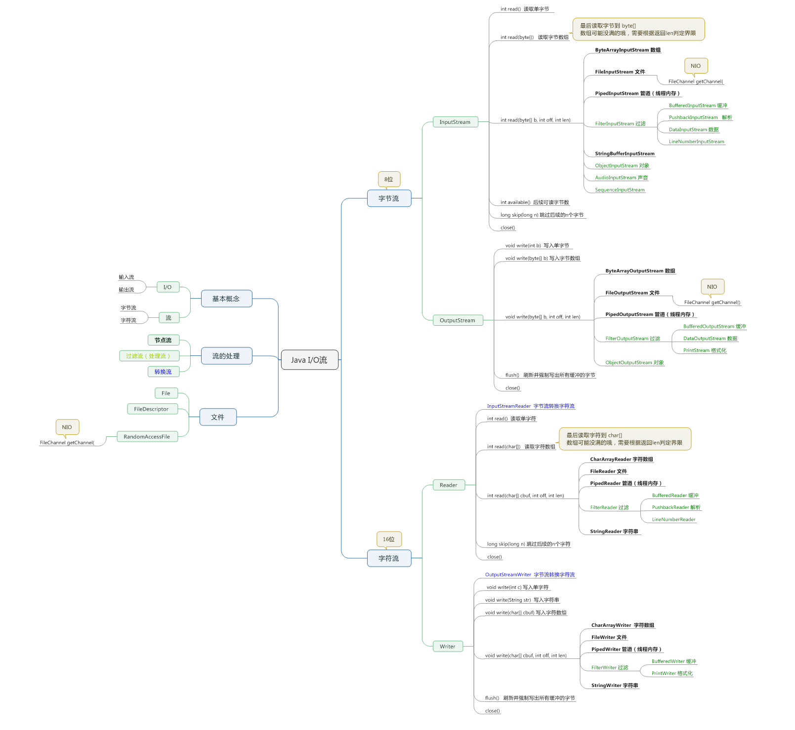

# 命令行
## input
```
Scanner sc = new Scanner(System.in);
String input = sc.next();
```

## output
```
System.out.println();
System.out.format("First name: %s, Last name: %s", first, last);
```

# 文件目录操作
## 目录操作
```java
// 复制文件 替换
Path source = Paths.get("D:\\Project\\EclipseWS4\\JavaLearn\\src\\test\\resources\\file.md");
Path target = Paths.get("D:\\Project\\EclipseWS4\\JavaLearn\\src\\test\\resources\\io_test.md");
try{
    Files.copy(source, target, StandardCopyOption.REPLACE_EXISTING);
}catch (IOException e){
    e.printStackTrace();
}

// 移动
try{
    Files.move(source, target, StandardCopyOption.REPLACE_EXISTING);
}catch (IOException e){
    e.printStackTrace();
}

// 创建文件
Files.createFile(Path file);

// 创建目录
Files.createDirectories(Path dir);

```

## 文件操作
* java.nio.file.Files：创建 删除 检查是否存在 读取 写入
* 随机访问文件java.nio.channels.SeelableByteChannel
```java
//写
Charset charset = Charset.forName("UTF-8");
Assert.assertEquals("UTF-8", charset.toString());
String line1 = "Easy read and write";
String line2 = "with java.nio.file.Files";
Path textFiles = Paths.get("D:/Project/EclipseWS4/JavaLearn//src/test/resources/test.md");
List<String> lines = Arrays.asList(line1, line2);
try {
    Files.write(textFiles, lines, charset);
} catch (IOException e) {
    e.printStackTrace();
}

//读
List<String> linesRead = null;
try {
    linesRead = Files.readAllLines(textFiles);
} catch (IOException e) {
    e.printStackTrace();
}
if (linesRead != null) {
    for(String line: linesRead){
        System.out.println(line);
    }
}
```

# 流操作

