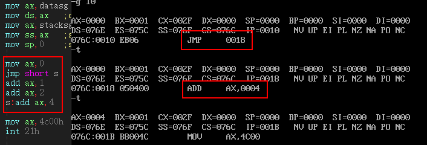
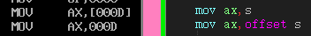

# 资源
* [汇编实验报告](http://m.dongjinxudianchi.com/ztnews/kghfdh9d8kaadh898b8ahlej.html)
* [OSBox汇编详细入门：8086汇编](http://feichashao.com/dosbox_basic_tutorial/)
# 笔记
## 寄存器

```
ds 默认数据段地址
```
```
cs:ip 代码
ss:sp 栈顶
[address]表示address偏移地址内存的数据 ds 默认数据段地址
```
```
注意
	8086不支持将数据直接送入段寄存器
	masm编译器与debug对于mov ax,[1]的处理方式不同，为了实现相同的功能，masm中需要将立即数1放到bx中，即
		mov ax,[1]变成 mov bx,1;mov ax,[bx] 或 显示的制定ds：mov ax,ds:[2]
```

## 编译链接
masm	编译
link	链接
## 寄存器
```
```

## 内存寻址
```
[bx]
[200+bx] 200[bx] [bx].200 三种写法结果一致
[si+100] [di+100]
[bx+si] [bx+di] [bx]+[si]
[bx+si+200] [bx+di+200] [bx][si].200 [bx].200[si] 200[bx][si]
```
## 显存读写p188
* 80*25 占2字节 显示缓存区共8页，每页4k(0b8000h~0b8f9fh)
* 0b8000h + 0a0h*p + r*2 : 在p页 r行处显示内容
* 低地址存字符，高地址存属性
* 
```
7		6	5	4	3		2	1	0
BL 		R 	G 	B 	I 		R 	G 	B
闪烁1	背景色3 	高亮1	前景色3
```
```asm
mov al,es:[si]		;存字符
mov ah,01110001b	;白底绿色
mov ds:[bx+di],ax
```

## 指令

* [8086指令](http://www.electronics.dit.ie/staff/tscarff/8086_instruction_set/8086_instruction_set.html)

### 指令
* mov word ptr ds:[0]
* loop tag # (cx)=(cx)-1, 判断cx中的值 不为零则跳转到tag处执行（cx中存放循环次数）
* inc 自加1
* and 将相应的位置设为零
* or 	将相应的位置设为一
* div 除法 结果低位放商，高位放余数 格式 div reg或div 内存单元 dx ax
* div 除法 除数reg|内存 8除数:被除数16放到ax 结果商al 余数ah  16除数:被除数32 高dx 低ax 结果商ax 余数dx
* jmp 无条件转移指令 jmp short 标号(8b位移)  jmp near ptr 标记(16b位移) jmp far ptr 标记 jmp 16寄存器
* jcxz 当cx=0跳转到标号执行

### 伪指令

* dup 用于数据的重复：db 3 dup (0,1,2)==db 0,1,2,0,1,2,0,1,2
* offset 取得符号的偏移地址 mov ax,offset tag


## 数据大小

dw define word 一个字，二字节
db define byte 一个字节
dd define dword 双字节

## 技巧
1. 小写字母转换为大 and al,11011111b, 大写字母变小 or al,00100000b
*
